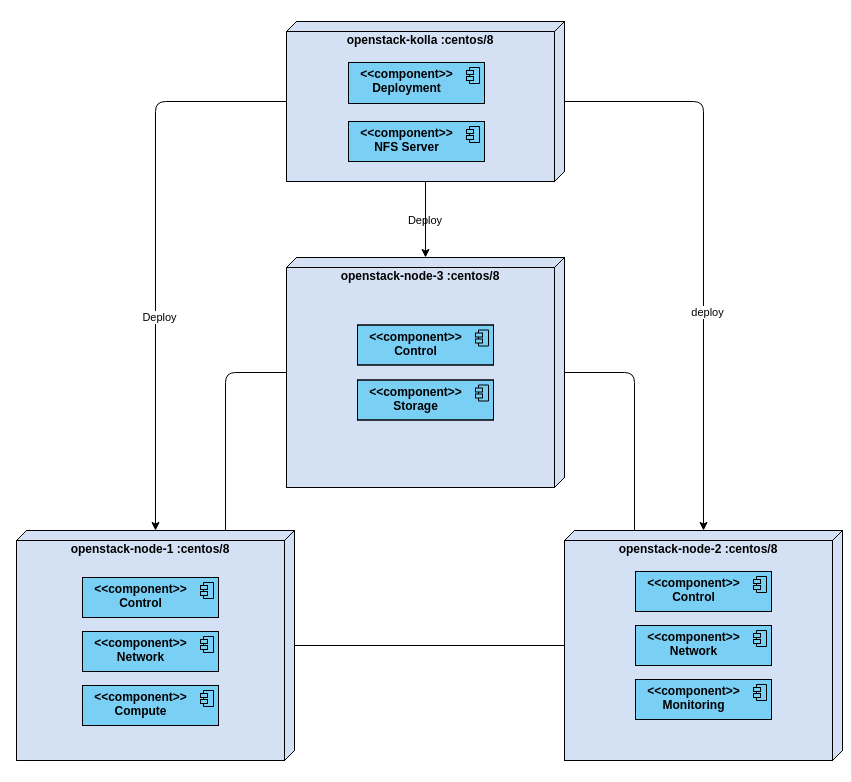
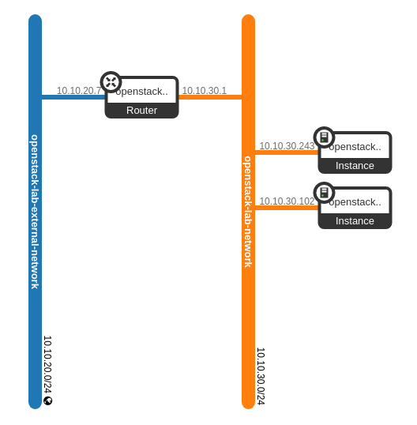
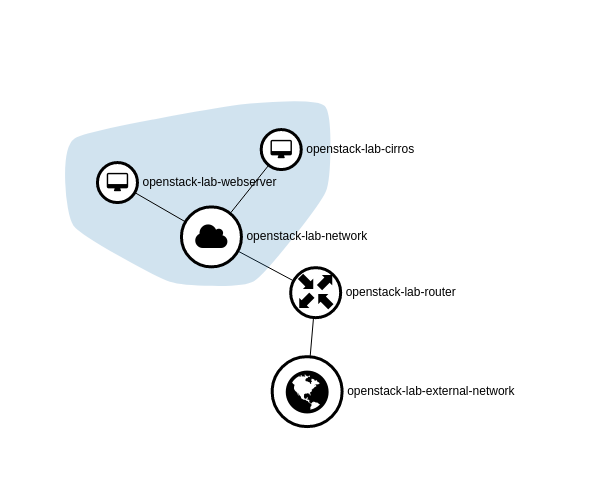

# openstack-kolla-lab

This is a lab of openstack victoria, deploy with kolla-ansible.
https://docs.openstack.org//kolla-ansible/latest/doc-kolla-ansible.pdf 

This lab deploy this cloud infrastructure :
1. Some Flavors
1. Centos 8 and Cirros Images
1. Network
   1. One internal network with subnet
   1. One External network
   1. One router to connect networks
   1. Two floating IPs for two compute instance
1. Security
   1. Deploy vagrant public key as available key pair
   1. One generic security group for SSH and ICMP
   1. One security group for web server, with ingress 80 and 443
1. One instance of Nginx in Centos 8 deploy with cloud-init
1. One instance of Cirros

Start the lab with :
1. Start VMs with `vagrant up --no-parallel`
1. Deploy Openstack with command on openstack-kolla :
   1. source pyvirtenv/bin/activate
   1. `cd /etc/kolla`
   1. check connection `ansible -i inventory.yml all -m ping`
   1. deploy Openstack `kolla-ansible -i inventory.yml deploy`
1. Generate ENV with `kolla-ansible post-deploy`
1. Source ENV `. admin-openrc.sh`
1. Deploy Infra with terraform, first terraform/infra, next terraform/project
   1. `terraform init`
   1. `terraform validate`
   1. `terraform plan -out=tfplan`
   1. `terraform apply tfplan`

Get Floating IP with openstack command `openstack floating ip list` or `openstack server list`

Enjoy !!!
