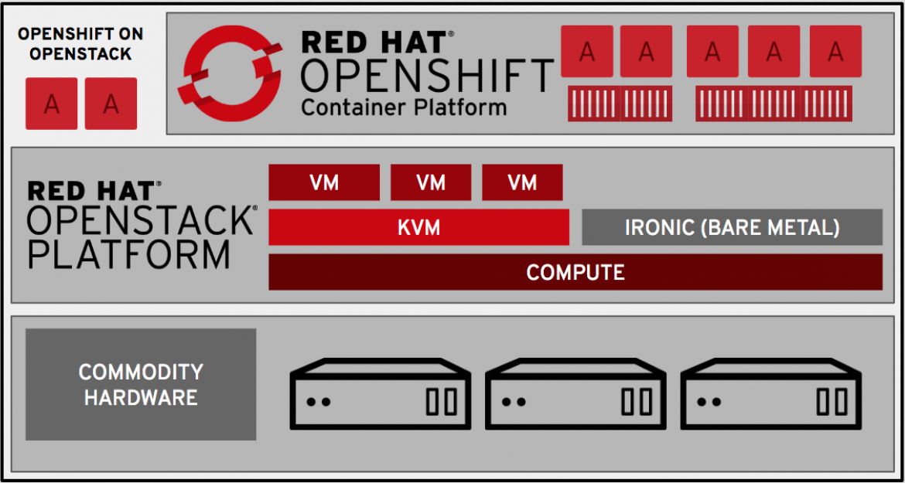

# OpenStack vs OpenShift

- Same problem as VMs vs Containers
- VM: "Persistent component"
- Container: "Ephemeral component"
- Not all components of an information system are containerizable
- Despite the overlap between these tools, we should not think of OpenStack vs OpenShift, but OpenStack & OpenShift the 2 being complementary

# OpenStack & OpenShift

OpenShift on OpenStack, one of the recommended installation methods, allows for example to manage part of the OpenShift cluster automatically (Cluster AutoScaling)

 

*https://www.redhat.com/fr/blog/modern-hybrid-cloud-platform-innovation-containers-cloud-openshift-openstack

OpenStack provide also Magnum component that allow to deploy container orchestration engines like Kubernetes.